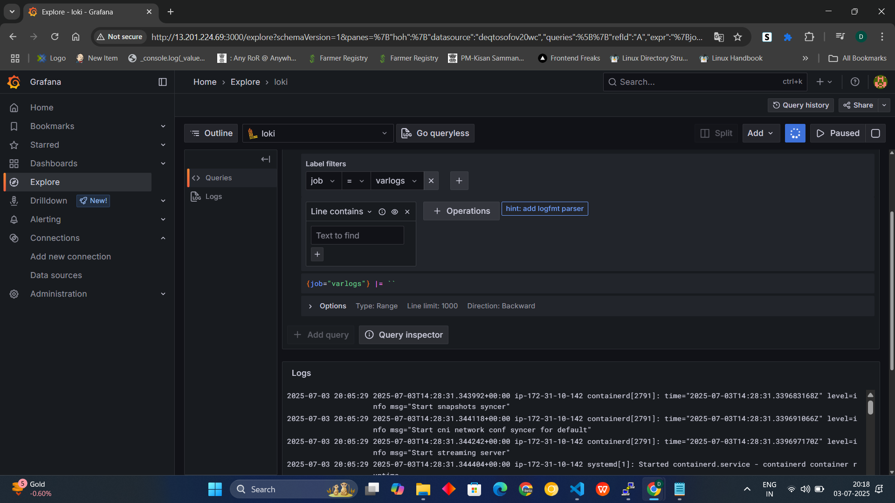
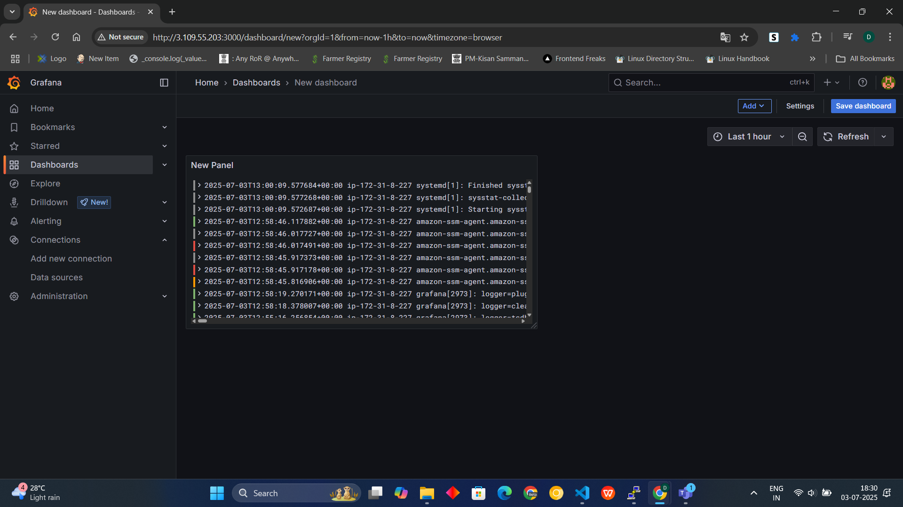
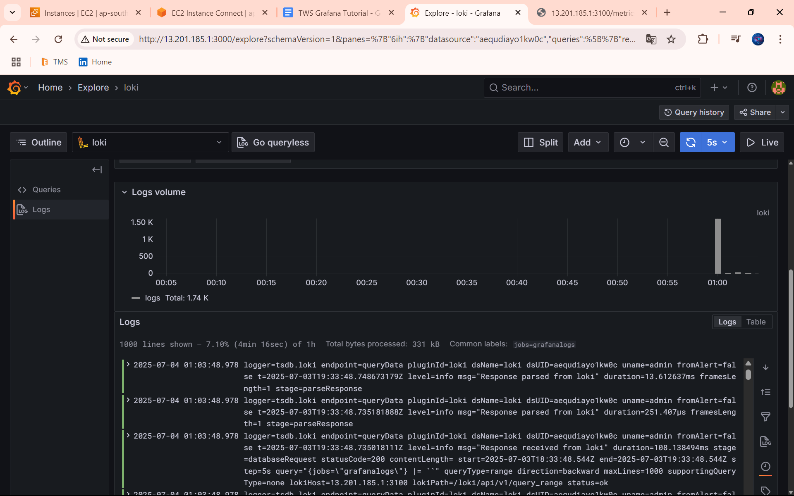
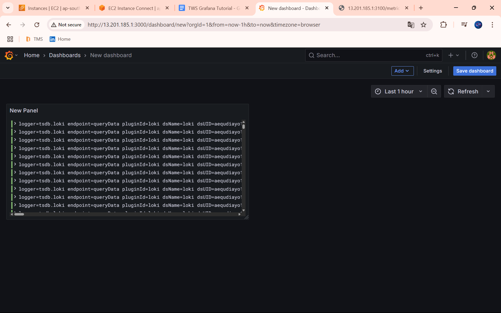

# 📈 Real-Time Log Monitoring with Grafana, Loki, Promtail, and Docker on Ubuntu

This guide will help you set up a real-time log monitoring stack using Grafana, Loki, and Promtail, all running in Docker containers on Ubuntu.

---

## 🟢 1. Install Grafana (Ubuntu)

```bash
sudo apt-get install -y apt-transport-https
sudo apt-get install -y software-properties-common wget
sudo wget -q -O /usr/share/keyrings/grafana.key https://apt.grafana.com/gpg.key
```

```bash
echo "deb [signed-by=/usr/share/keyrings/grafana.key] https://apt.grafana.com stable main" | sudo tee /etc/apt/sources.list.d/grafana.list
```

```bash
sudo apt-get update
sudo apt-get install grafana -y
```

**Start and enable Grafana:**
```bash
sudo systemctl start grafana-server
sudo systemctl enable grafana-server
sudo systemctl status grafana-server
```

- 🌐 Access Grafana: [http://localhost:3000](http://localhost:3000)
- 🔐 Default Credentials: `admin` / `admin`

---

## 🐳 2. Install Docker

```bash
sudo apt install docker.io -y
sudo usermod -aG docker $USER
```

**Check Docker is working:**
```bash
docker ps
```

---

## 📁 3. Create Config Folder

```bash
mkdir grafana_configs
cd grafana_configs
```

---

## 🔽 4. Download Loki & Promtail Configs

**Loki config:**
```bash
wget https://raw.githubusercontent.com/grafana/loki/v2.8.0/cmd/loki/loki-local-config.yaml -O loki-config.yaml
```

**Promtail config:**
```bash
wget https://raw.githubusercontent.com/grafana/loki/v2.8.0/clients/cmd/promtail/promtail-docker-config.yaml -O promtail-config.yaml
```

---

## ▶️ 5. Run Loki Container

```bash
docker run -d --name loki \
  -v $(pwd):/mnt/config \
  -p 3100:3100 \
  grafana/loki:2.8.0 \
  --config.file=/mnt/config/loki-config.yaml
```

**Verify:**
- http://<YOUR_PUBLIC_IP>:3100/ready
- http://<YOUR_PUBLIC_IP>:3100/metrics

---

## ▶️ 6. Run Promtail Container

```bash
docker run -d --name promtail \
  -v $(pwd):/mnt/config \
  -v /var/log:/var/log \
  --link loki \
  grafana/promtail:2.8.0 \
  --config.file=/mnt/config/promtail-config.yaml
```

**Check container status:**
```bash
docker ps
```

---

## 📊 7. Connect Loki as Data Source in Grafana

1. Login to Grafana: http://<IP>:3000
2. Go to **Connections > Data Sources**
3. Choose **Loki**
4. Set URL: `http://<IP>:3100`
5. Click **Save & Test**

---

## 🔎 8. Explore Logs in Grafana

1. Go to **Explore** tab
2. Select:
   - **Label:** `job`
   - **Value:** `varlogs`
3. Run Query to view log /var/log/*log

---

## 🎉 Output



---

## 🎉 Dashboard Output



---

## 📁 9. Add Specific Logs (e.g., Grafana Logs)

1. Edit Promtail config:
    ```bash
    nano promtail-config.yaml
    ```
2. Add this scrape config:
    ```yaml
    - targets:
        - localhost
      labels:
        job: grafanalogs
        __path__: /var/log/grafana/*log
    ```
3. Restart promtail:
    ```bash
    docker restart <promtail_container_id>
    ```
4. In Grafana > Explore:
    - **Label:** `job`
    - **Value:** `grafanalogs`
    - View logs from `/var/log/grafana/*.log`

---

## 🎉 Output



---

## 🎉 Output


